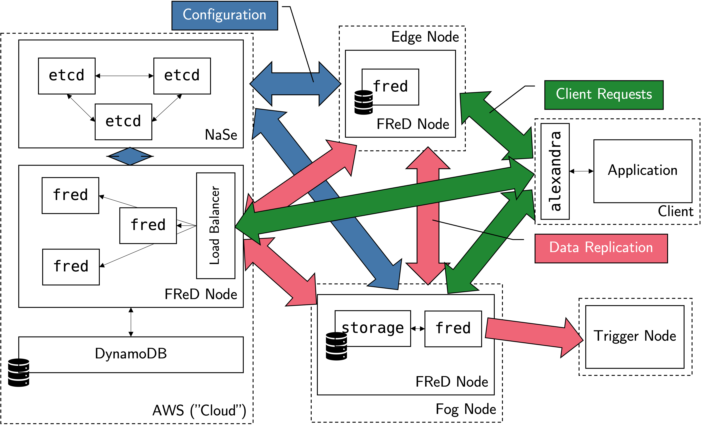

## Architecture

A FReD deployment comprises a FReD node on all or a subset of fog nodes in the available fog infrastructure.
This can range from edge nodes all the way to the cloud, different node sizes are possible.

Each FReD node consists of a number of machines running the `fred` software and storage backend.
If a node has multiple servers, a load balancer distributes requests among the nodes.
The storage backend can be a cloud database like DynamoDB, a dedicated database server, or embedded on a single machine with the `fred` software.

Additionally, a centralized "Naming Service" ("NaSe") based on `etcd` keeps track of system configuration and helps nodes find each other (a decentralized version is in progress.)

Clients interact with the FReD system through the _Application Level Extension to Allow Node Discovery and Replica Appointment_ (_ALExANDRA_) middleware.
Applications can create their keygroups to store data as needed and instruct FReD to replicate individual keygroups to where that data is needed.

Additionally, Trigger Nodes can be set up for every keygroup.
Trigger nodes are sent all updates for all data items in a particular keygroup.
This can be useful to transform data to write it back into FReD, event processing, and more.
